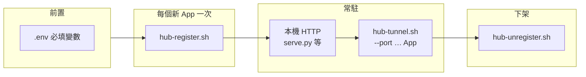

# Hub 操作手冊（範例：CoolAPP、本機埠 **5654**）

以下命令都在專案目錄 `Helloworld_web` 下執行。

**Windows（PowerShell）**：已提供與 `hub-*.sh` 對應的腳本——`hub-common.ps1`、`hub-tunnel.ps1`、`hub-register.ps1`、`hub-unregister.ps1`、`hub-status.ps1`、`hub-applist.ps1`、`hub-ssh.ps1`。請先安裝 **OpenSSH 客戶端**（選用功能或 Git for Windows 內建），將 `.env` 中的 **`SSH_KEY`** 設為本機路徑（例如 `C:\Users\you\.ssh\key.pem` 或 `C:/Users/you/.ssh/key.pem`），並在必要時執行 `Set-ExecutionPolicy -Scope CurrentUser RemoteSigned`。用法範例：`.\hub-register.ps1 CoolAPP`、`.\hub-tunnel.ps1 -Port 5654 CoolAPP`。

---

## 應用（App）生命週期

一個 **Hub 應用** 指：在 EC2 的 Caddy 上有一條 **`/應用名/`** 路由，且本機有一條 **`ssh -R`** 把 EC2 上對應回環埠轉到本機某 HTTP 服務。建議依序理解為下列階段。

| 階段 | 說明 | 典型命令／狀態 |
|------|------|----------------|
| **0. 前置** | 專案根目錄具備 **`.env`**（或等效 **`export`**），內容符合 `hub-common.sh` 必填變數 | `cp .env.example .env` 並編輯 |
| **1. 註冊（一次性）** | 在 EC2 寫入 **`${HUB_DIR}/<AppName>.caddy`** 並 **`caddy reload`**；**不**建立 SSH | `./hub-register.sh <AppName>` |
| **2. 本機服務** | 本機 HTTP 監聽（例如 **`serve.py`**），埠須與隧道一致 | `PORT=5654 python3 serve.py` |
| **3. 隧道（常駐）** | 本機執行 **`hub-tunnel.sh --port <本機埠> <AppName>`**，讓 EC2 **`127.0.0.1:<遠端埠>`** 連到本機 | 終端保持開啟或改 **`nohup`** 等 |
| **4. 運行中** | 瀏覽器開 **`${HUB_PUBLIC_URL}/<AppName>/`**；斷線／休眠會中斷對外服務 | `./hub-status.sh` 自查 |
| **5. 暫停** | 關掉本機 **`hub-tunnel`**（與可選關 **`serve.py`**）；EC2 上 **Caddy 片段可保留**（下次只重開隧道） | Ctrl+C 或殺 **`ssh`** |
| **6. 註銷（下架）** | 刪 EC2 路由檔並 reload；預設一併殺本機對該埠的 **`ssh -R`** | `./hub-unregister.sh <AppName>` |

**根站（非子路徑）**：不帶應用名執行 **`./hub-tunnel.sh`**，將本機 **`PORT`／8080** 對到 EC2 **`127.0.0.1:10080`**，由主 **`Caddyfile`** 的 **`handle`** 接 **`/`**；無需 **`hub-register.sh`**。



---

## 0. 遠端設定（`.env`）

複製範本後編輯 **`SSH_KEY`**、**`SSH_TARGET`** 等（所有 Hub 腳本經 **`hub-common.sh`** 自動載入）：

```bash
cp .env.example .env
# 編輯 .env：至少設定 SSH_KEY、SSH_TARGET；HUB_PUBLIC_URL 需與瀏覽器實際 HTTPS 前綴一致
```

**必須**填好 **`.env.example`** 裡每一項（或等效的 **`export`**）；**`hub-common.sh` 已無預設值**，缺任一變數腳本會直接報錯退出。

手冊範例網址假設 **`HUB_PUBLIC_URL=https://db.xception.tech:1080`**。

---

## 1. 註冊 CoolAPP（只做一次）

本機服務要先在 **`http://127.0.0.1:5654`** 跑得起來；註冊只是把 **EC2 上 Caddy 的路由**寫好。

```bash
cd /path/to/Helloworld_web
./hub-register.sh CoolAPP
```

- 若顯示**已存在**而結束（exit **2**），代表註冊過了，**不必**再跑；若要覆寫才用 `./hub-register.sh --force CoolAPP`。

---

## 2. 開隧道（要一直開著）

另開終端（或背景跑），**應用名須與註冊時相同**：

```bash
cd /path/to/Helloworld_web
./hub-tunnel.sh --port 5654 CoolAPP
```

（亦可：`./hub-tunnel.sh CoolAPP --port 5654`）

---

## 3. 瀏覽器

```text
${HUB_PUBLIC_URL}/CoolAPP/
# 例如 https://db.xception.tech:1080/CoolAPP/
```

（建議網址結尾加 **`/`**。）

---

## 4. 查詢

**只看已註冊的應用名稱：**

```bash
./hub-applist.sh
```

**本機隧道 + EC2 監聽 + Caddy 路由一覽：**

```bash
./hub-status.sh
```

（**`hub-status.sh`** 輸出為簡體中文區塊標題，與本手冊用語無關。）

---

## 5. 註銷 CoolAPP（刪路由 + 停本機 SSH）

在**當初跑 `hub-tunnel.sh` 的那台電腦**執行：

```bash
./hub-unregister.sh CoolAPP
```

- 會刪 EC2 上的 **`hub-routes/CoolAPP.caddy`** 並 **reload Caddy**。  
- 會結束本機對應的 **`ssh -R`**；當時前台的 **`./hub-tunnel.sh`** 會跟著**錯誤退出**，屬正常。  
- 只刪設定、不殺 SSH：`./hub-unregister.sh --no-kill CoolAPP`

---

## 共用環境變數（`hub-common.sh` / `.env`）

腳本會自動 **`source`** 專案根目錄的 **`.env`**（若存在）。下列變數**皆必填且不得為空字串**（可改在 shell 內 **`export`** 覆寫）。

| 變數 | 用途 |
|------|------|
| **`SSH_TARGET`** | SSH 目標，例如 **`ubuntu@example.com`** |
| **`SSH_KEY`** | 本機私鑰路徑（**`-i`** 傳給 **`ssh`**） |
| **`SSH_PORT`** | SSH 埠（數字，例如 **`22`**） |
| **`HUB_DIR`** | EC2 上 Hub 片段目錄（例如 **`/etc/caddy/hub-routes`**），內含 **`*.caddy`** |
| **`MAIN_CFG`** | EC2 上 Caddy 主設定路徑（例如 **`/etc/caddy/Caddyfile`**），須 **`import ${HUB_DIR}/*.caddy`**（或等效） |
| **`HUB_PUBLIC_URL`** | 瀏覽器實際使用的 HTTPS 前綴（**無尾隨斜線**），僅用於腳本提示與註冊輸出，例如 **`https://域名:1080`** |

**應用名規則**（**`hub-register` / `hub-tunnel` / `hub-unregister`** 皆會驗證）：長度最多 **48** 字元；第一字元須為英文或數字；其餘可為英文、數字、**`_`**、**`-`**。正則概念：`^[a-zA-Z0-9][a-zA-Z0-9_-]{0,47}$`。

**Hub 遠端回環埠（預設）**：`20000 + (zlib.adler32(應用名 UTF-8 位元組) mod 10000)`，落在 **20000–29999**。本機預覽：

```bash
python3 -c "import zlib; n=b'CoolAPP'; print(20000+zlib.adler32(n)%10000)"
```

若曾用 **`REMOTE_PORT`** 覆寫，**註冊／隧道／註銷**時須使用**相同**覆寫值，且 Caddy 片段內 **`reverse_proxy`** 埠須一致。

---

## 各工具參數與環境變數詳解

### `hub-register.sh`

在 EC2 建立 **`${HUB_DIR}/<AppName>.caddy`**（含 **`handle` / `handle_path` / `reverse_proxy`**），必要時建立 **`_keep.caddy`**，然後 **`caddy validate` + `systemctl reload caddy`**。**不會**停止或修改既有 SSH。

**語法：**

```text
./hub-register.sh [--force ...] <AppName>
```

| 參數 | 說明 |
|------|------|
| **`--force`** | 可出現多次（效果同單次）。若遠端已有 **`${AppName}.caddy`**，預設**失敗退出**；加 **`--force`** 則覆寫該檔並 reload。 |
| **`<AppName>`** | 路徑段名稱，規則見上表。 |

| 環境變數（可選） | 說明 |
|------------------|------|
| **`REMOTE_PORT`** | 覆寫寫入 Caddy 片段的 **`reverse_proxy 127.0.0.1:埠`**；未設則用 **`hub_remote_port(AppName)`**。之後 **`hub-tunnel`**／**`hub-unregister`** 須一致。 |

**結束代碼：** **`0`** 成功；**`1`** 用法錯誤、SSH／Caddy 失敗；**`2`** 遠端路由已存在且未使用 **`--force`**（**不**改 Caddy、**不**動 SSH）。

---

### `hub-tunnel.sh`

建立 **`ssh -N`** 反向轉發：**`EC2 ${REMOTE_BIND}:${REMOTE_PORT}` → 本機 `127.0.0.1:${LOCAL_PORT}`**。程式會**一直佔用該終端**，直到連線中斷或被殺。

**語法：**

```text
./hub-tunnel.sh [--port <本機埠> | -p <本機埠>] [<AppName>]
./hub-tunnel.sh [--help | -h]
```

| 參數 | 說明 |
|------|------|
| **（無應用名）** | **根站模式**：本機 **`LOCAL_PORT`**（見下）→ EC2 **`127.0.0.1:10080`**（**`REMOTE_PORT`** 預設 **10080**）。 |
| **`<AppName>`** | **Hub 應用模式**：本機 **`LOCAL_PORT`** → EC2 **`127.0.0.1:<REMOTE_PORT>`**；**`REMOTE_PORT`** 預設由應用名推算。 |
| **`--port` / `-p`** | 本機 HTTP 服務埠；未指定時 **`LOCAL_PORT`** 取自環境變數 **`PORT`**，再預設 **8080**。 |
| **`--help` / `-h`** | 印出用法後以 **`0`** 退出。 |

**參數順序：** **`--port`** 與 **`<AppName>`** 可互換（先解析旗標再收單一位置參數）。

| 環境變數（可選） | 說明 |
|------------------|------|
| **`PORT`** | 無 **`-p/--port`** 時的本機埠（預設 **8080**）。 |
| **`REMOTE_BIND`** | SSH **`-R`** 在 EC2 上的綁定位址，預設 **`127.0.0.1`**。設 **`0.0.0.0`** 可讓非本機連線打到該埠（需 **`sshd`**／防火牆允許；常與直連 HTTP 測試一併討論，見 **`SETUP.md`**）。 |
| **`REMOTE_PORT`** | 覆寫 EC2 側轉發埠。Hub 模式預設為 **`hub_remote_port(AppName)`**；根站模式預設 **10080**。 |

**結束代碼：** 誤用參數為 **`1`**；成功則**不返回**（**`exec ssh`**），直到 SSH 結束。

---

### `hub-unregister.sh`

預設：殺本機轉發到 **`127.0.0.1:<REMOTE_PORT>`** 的 **`ssh -R`**（與 **`hub_kill_tunnels_for_remote_port`** 邏輯一致），再刪遠端 **`${HUB_DIR}/<AppName>.caddy`** 並 **`caddy validate` + reload**。

**語法：**

```text
./hub-unregister.sh [--no-kill ...] <AppName>
```

| 參數 | 說明 |
|------|------|
| **`--no-kill`** | 可重複。若指定，**不**殺本機 SSH，只刪遠端片段並 reload（自行停 **`hub-tunnel.sh`**）。 |
| **`<AppName>`** | 要移除的應用名；**`REMOTE_PORT`** 預設與該名對應，見下。 |

| 環境變數（可選） | 說明 |
|------------------|------|
| **`REMOTE_PORT`** | 與註冊／隧道時相同；用於比對本機 **`ssh -R … 127.0.0.1:${REMOTE_PORT}:…`**。若註冊時曾覆寫埠，此處**必須**同樣覆寫。 |

---

### `hub-status.sh`

**無命令列參數。** 依序輸出：本機含 **`-R`** 且目標主機為 **`SSH_TARGET`** 的 **`ssh`** 行程、EC2 上 **10080** 與 **20000–29999** 區間相關 **LISTEN**、遠端 **`${HUB_DIR}/*.caddy`**（略過 **`_keep`**）與片段內 **`reverse_proxy`** 摘要。需能 **`BatchMode`** SSH 登入 EC2。

---

### `hub-applist.sh`

**無命令列參數。** 從 EC2 的 **`${HUB_DIR}`** 列出所有 **`.caddy`** 檔名（去掉副檔名），排除 **`_keep`**，每行一個、不分大小寫排序。若無應用，向 **stderr** 印提示並以 **`0`** 結束。

---

### `hub-ssh.sh`

互動式登入與 **`hub-tunnel`** 相同的 **`SSH_TARGET`**（**`-t`** 配置 tty）。

**語法：** **`./hub-ssh.sh`**（無額外參數）。

| 環境變數（可選） | 說明 |
|------------------|------|
| **`REMOTE_CMD`** | 遠端執行的指令字串；預設 **`cd ~/webTunnel && exec bash -l`**。改為 **`bash -l`** 等可避免硬編目錄。 |

---

### `serve.py`（本機 HTTP，與 Hub 搭配）

專案內典型用法：**一個應用一個埠**，再 **`hub-tunnel.sh --port 該埠 應用名`**。

| 環境變數（可選） | 預設（見 **`SETUP.md`**） | 說明 |
|------------------|---------------------------|------|
| **`PORT`** | **8080** | 監聽埠。 |
| **`HOST`** | **127.0.0.1** | 綁定位址。 |
| **`HELLO_TITLE`** | **Hello, World** | 頁面 **`h1`** 文字（已做 HTML 跳脫）。 |

---

## 延伸閱讀

完整架構、EC2 **Caddy**、防火牆與重開機後恢復步驟見 **`SETUP.md`**。
